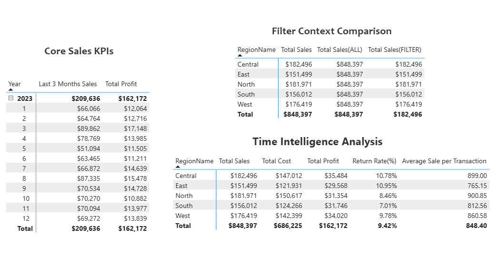

# DAX Depo — Advanced DAX Calculations

<div align="center">


**Advanced DAX portfolio project using matrix visuals to demonstrate filter context and time intelligence.**

</div>

---

## Overview

| Field | Details |
|-------|---------|
| **Business purpose** | Showcase advanced DAX without traditional charts — insights via matrix visuals only |
| **Focus** | Filter context, time intelligence, sales & returns modeling |
| **Report file** | `DAX Depo.pbix` |
| **Dataset** | `data/DAX_Depo_Sample_Datasets.xlsx` |
| **Attribution** | Adapted from [DAX Depo](https://github.com/PareeSojitra0803/DAX_Depo_Advanced_Calculations_Using_DAX_PowerBI) |

---

## Data Model (Star Schema)

| Table | Type | Description |
|-------|------|-------------|
| `Sales_Fact` | Fact | Sales transactions |
| `Returns_Fact` | Fact | Returned items |
| `Customer_Dim` | Dimension | Customer attributes |
| `Product_Dim` | Dimension | Product details |
| `Date_Dim` | Dimension | Calendar table |
| `Region_Dim` | Dimension | Sales regions |

---

## DAX Highlights

- Filter context & row context behavior
- Time intelligence (YTD, MTD, prior period comparisons)
- Advanced aggregations via matrix visuals
- Sales vs. returns analysis

---

## Screenshots



---

## How to Run

1. Open `DAX Depo.pbix` in Power BI Desktop.
2. Ensure `data/DAX_Depo_Sample_Datasets.xlsx` is accessible if re-linking sources.
3. Refresh and explore matrix-based insights.

---

## Folder Contents

```
dax-depo-advanced/
├── DAX Depo.pbix
├── data/DAX_Depo_Sample_Datasets.xlsx
├── screenshots/Visuals.png
└── README.md
```
